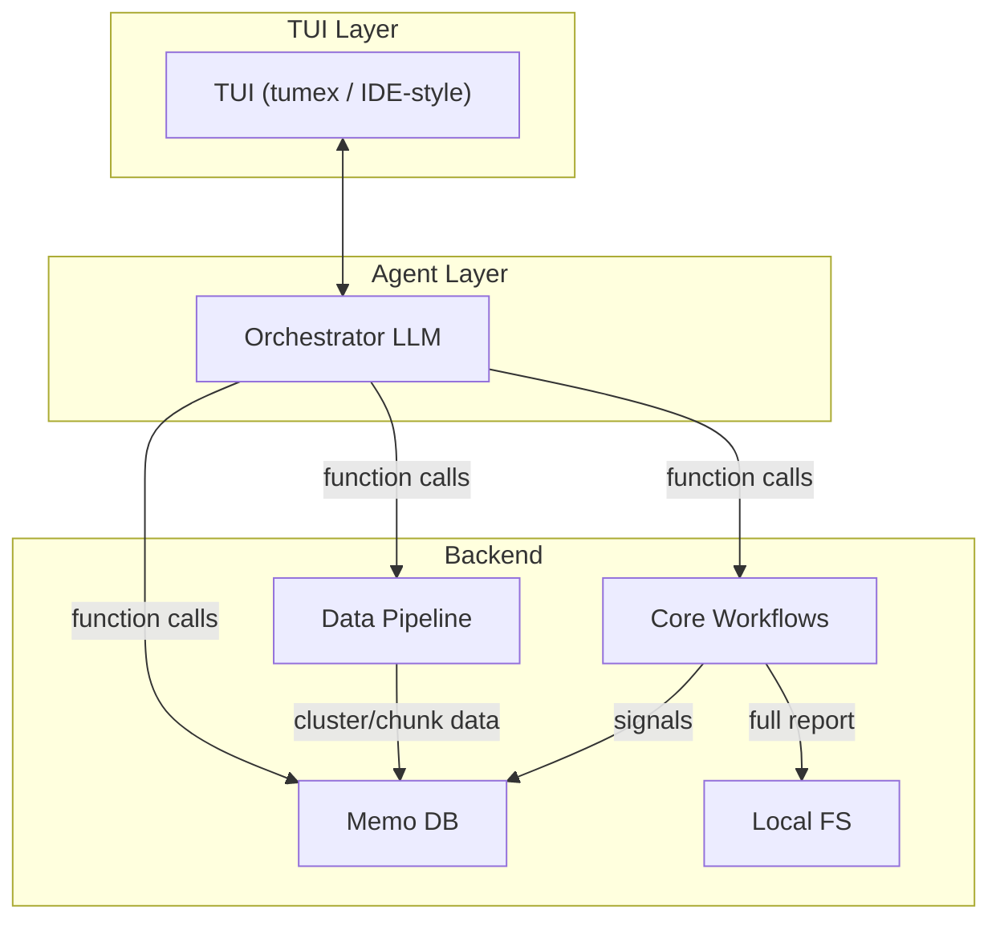

# Reader

Reader is a research-style self-evolution reading tool. For now it helps provide pre-reading short reports to bridge the knowledge gap before reading academic papers. A side-project for a better academic paper reading experience — it can be more than that with time and personal interests.

## Design



- **TUI** (tumex or coding IDE-like style) supports chat + graph + artifact
- **Agent** orchestrates via function/tool calls
- **Backend**: data pipeline, memory db, local fs, core workflows

---

## How

### TUI

Not fully implemented; ideas only. Planned: tumex for now.

### Agent

Orchestrator-style / light / mini / flash LLM. Main role: orchestration via tool calls.

### Data Pipeline

The workflow is orchestrated by [`run_hf_data`](reader/src/reader/pipelines/collect_data.py) in `collect_data.py`:

**Phase 1 (sequential)**

- `fetch_hf_data`: `_ingest_fresh_papers` — fetch HF monthly papers, embed, cluster, write to memo via `memo.fresh_paper`

**Phase 2 (parallel, after `get_best_clustering`)**

- `cluster_summarization`: `_enrich_clusters` — LLM summarization of clusters, write via `memo.inject_clusters_observation`
- `paper_chunk`: `_process_paper_chunks` — chunk papers via paperchunk lib, write via `memo.inject_papers_chunk`

See [hf_data/blocks.py](reader/src/reader/pipelines/hf_data/blocks.py) for `get_hf_paper_metadata`, `generate_clustering_reports`, `summarize_clusters_parallel`, `process_paper_chunks`.

### Core Workflows

Workflows are exposed in two ways:

- **Subcommands** (development): CLI entry points for manual runs during development — see [cli.py](reader/src/reader/cli.py)
- **Function calls** (integration): callable tools for the orchestrator/agent; the agent invokes these workflows via function/tool calls, not CLI

| Workflow                 | Purpose                                                   |
| ------------------------ | --------------------------------------------------------- |
| `hf-data`                | Run HF data pipeline (fetch, cluster, chunk)              |
| `generate-report`        | Run report generation pipeline                            |
| `check-report-signature` | Load report, validate, compute signature, verify via memo |
| `render-report`          | Load report and display in TUI                            |
| `self-evolution`         | Review topics, suggest merge/archive/split (memory health advisor) — *to be added* |

### Local FS

Local filesystem caches the complete report in JSON format. Memo DB does not store the full report; it stores only high-quality signals (metadata, signatures, etc.). Full content lives on disk; memo indexes and links to it.

### Memo DB

SQLite-based memory service. Semantic layer between agent and raw data. Stable DB query performance and monitoring for workflows. Semantic selectors for agent queries. See [memory_cli/README.md](memory_cli/README.md) and [memory_cli/docs/design.md](memory_cli/docs/design.md). Key commands: `fresh-paper`, `get-best-run`, `inject-papers-chunk`, `inject-clusters-observation`, `get-clusters-observation`, `get-topic-resolver-metadata`, `get-report-generation-metadata`, `new-memory`, etc.

---

## Current Status

- **Report generation workflow**: ~90% done
- **Core design**: state machine–style flow for heavy LLM calls (analysis, planning, writing), plus layered llm call retry:
  - HTTP error–based retry (base layer)
  - Simple, lightweight heuristic rules (first retry layer)
  - Workflow node–specific retry: ensure LLM responses are in right format, pass basic semantic requirements, and meet specific workflow acceptance criteria
- **Workflow register**: failure/rerun support for report generation
- **Data pipeline**: implemented; algo needs tuning
- **Agent interface**: to be planned
- **TUI**: to be planned

---

## Why

### Why TUI?

Avoid heavy or "fancy" frontends — or a bet that the heavy user intent once embedded in fancy frontends can now be handled by **chat** for document OS–like products. Plan: tumex with side windows for chat (main), graph (document system, navigation), artifact (single report reading). More details as development progresses.

### Why Data Pipeline Like That?

- **Collect by demand**: currently Hugging Face monthly papers only
- **Chunk strategy**: academic papers are well-structured; follow academic paper writing template; prefer HTML source to reduce chunk effort (no OCR)
- **paperchunk lib**: [reader/src/algo_lib/paperchunk/README.md](reader/src/algo_lib/paperchunk/README.md) — schema-first, scoring/training modes, HTML/PDF parsing
- **Embedding + clustering**: monthly papers → stable groups as candidate topics; LLM enrichment adds semantic labels for humans

### Why Embedding + Clustering, Not LLM Grouping?

1. **Cost** — LLM grouping is expensive
2. **Speed** — geometric clustering is faster
3. **Bias balance** — LLM is a semantic advisor; geometric clustering adds a geometric bias; semantic and geometric views work together
4. **Topic resolver**: merge/create is purely geometric (cosine similarity on centroids) — see [topic_resolver/resolver.py](reader/src/algo_lib/topic_resolver/resolver.py)
5. **Self-evolution pipeline**: LLM (semantic side) reviews and suggests on geometric decisions

---

## Project Structure

```
reader/                      # repo root
├── reader/                  # main Python package
├── reader/src/algo_lib/      # paperchunk, topic_resolver, clustering
├── memory_cli/              # Rust SQLite memory service (memo)
├── eval/                    # experimental: cluster enrichment eval
├── eval_dspy/               # experimental: DSPy-based eval
└── paper_chunk/             # experimental: paper chunk curation rules
```

`eval`, `eval_dspy`, and `paper_chunk` are small experimental projects for parts of the core workflow (e.g., cluster enrichment eval, DSPy-based eval, paper chunk curation rules).

### Few words for what A Development Day looks like ;)

1. Iterate ideas/designs with or without ChatGPT thinking
2. Implement through Cursor (Composer 1 at first, now gradually Composer 1.5)
3. Human (me) mainly: design, code review (intent-focused, not line-by-line), handwritten commit messages to stay in the loop for every commit
4. Minimal unit tests — personal preference; rely on a reliable code agent and manual tests the human(me) preferred.

---

## Getting Started(development version)

```bash
# From reader/src/
uv sync
cd ../../memory_cli && cargo build && cd -

# HF data pipeline
python -m reader hf-data --config reader/pipelines/hf_data/config/hf-data.yaml

# Report generation
python -m reader generate-report --config reader/pipelines/report_generation/config/report.yaml

# Check report signature
python -m reader check-report-signature --config reader/pipelines/report_signature_check/config/report_signature_check.yaml --report-file <path>

# Render report
python -m reader render-report --config reader/pipelines/render_report/config/render_report.yaml --report-file <path>
```

---

## References

- [reader_evolution_pipeline.md](reader/notes/reader_evolution_pipeline.md)
- [report_generation_design.md](reader/notes/report_generation_design.md)
- [memo_3_stage_rdb_rag_cli_and_tool_calls.md](memory_cli/docs/memo_3_stage_rdb_rag_cli_and_tool_calls.md)
