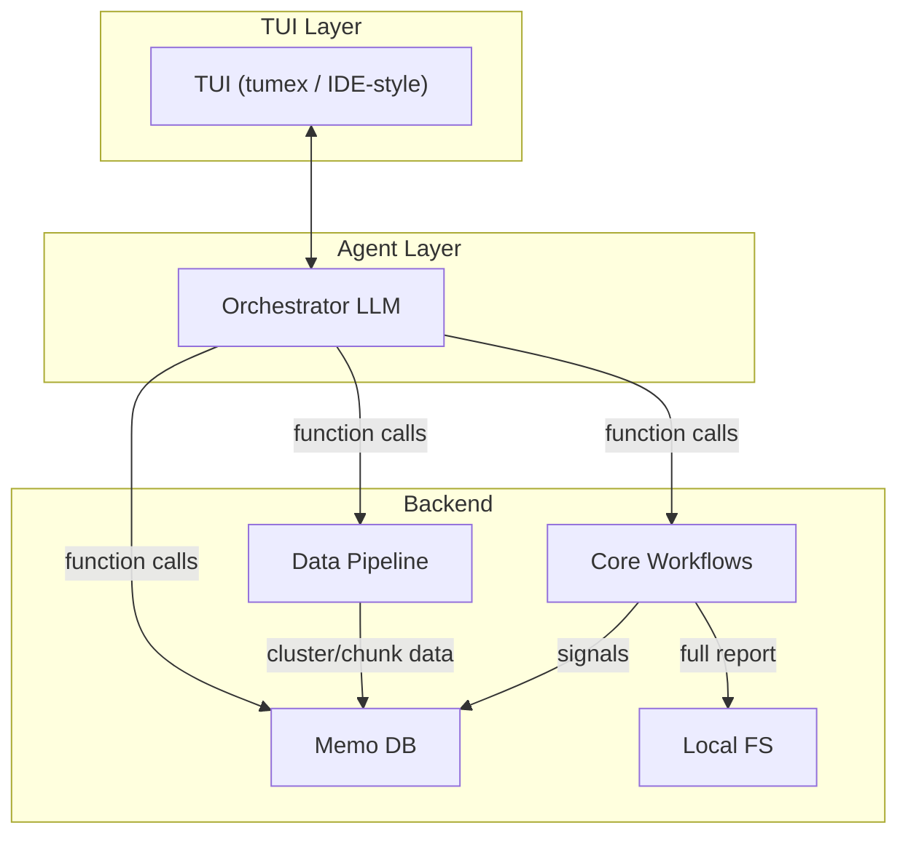

# Reader

Reader is an experimental research-reading system that helps bridge the knowledge gap before reading academic papers.

It automatically collects new research papers, clusters them into topics, and generates structured short reports using LLM-assisted workflows. The system also maintains a persistent “memory” of research topics to enable long-term evolution of knowledge.

The project explores how LLM agents and traditional data pipelines can work together to support a better academic reading workflow.

## Design



- **TUI** (tumex or coding IDE-like style) supports chat + graph + artifact
- **Agent** orchestrates via function/tool calls
- **Backend**: data pipeline, memory db, local fs, core workflows

---

## Core Components

### TUI

Not fully implemented; ideas only. Planned: tumex for now.

### Agent

Orchestrator-style / light / mini / flash LLM. Main role: orchestration via tool calls.

### Data Pipeline

The workflow is orchestrated by [`run_hf_data`](reader/src/reader/pipelines/collect_data.py) in `collect_data.py`:

**Phase 1 (sequential)**

— fetch HF monthly papers, embed, cluster, write to memo db.  

**Phase 2 (parallel)**

- `cluster summarization/enrichment`: LLM summarization of clusters and then write to memo db.
- `paper chunk`:  chunk papers via paperchunk lib and then write to memo db.

### Core Workflows

| Workflow                 | Purpose                                                   |
| ------------------------ | --------------------------------------------------------- |
| `generate-report`        | Run report generation workflow                            |
| `check-report-signature` | Load report, validate, compute signature, verify via memo |
| `render-report`          | Load report and display in TUI                            |
| `self-evolution`         | Run periodically to review topics, suggest merge/archive/split (memory health advisor) — *to be added* |

Workflows are exposed in two ways:

- **Subcommands** (development): CLI entry points for manual runs during development — see [cli.py](reader/src/reader/cli.py)
- **Function calls** (integration): callable tools for the orchestrator/agent; the agent invokes these workflows via function/tool calls, not CLI

Fun Fact :)    
During implementation, the report-generation workflow gradually evolved into a **state-machine style workflow** rather than a linear script.

Heavy LLM stages (analysis → planning → writing) behave naturally as explicit states, with controlled transitions and retries between them. This structure helps:

- keep LLM calls deterministic and inspectable
- isolate retry logic for each stage, f.e. 3 layers of retry:
   - HTTP error–based retry (base layer)
   - Simple, lightweight heuristic rules (first retry layer). see [RULES.md](reader/src/reader/pipelines/report_generation/judges/metircs/RULES.md).
   - Workflow node/loop–specific retry: ensure LLM responses are in right format, pass basic semantic requirements, and meet specific workflow acceptance criteria
- ensure intermediate failures do not corrupt finalized results.
- return clear status for agent to continue downstream tasks.
- (experimental) minimum-effort and clear boundary rerun implemented by a code agent — see [doc](reader/notes/report_generation_storage_rerun_policy.md).


### Local FS

Local filesystem caches the complete reports in JSON format. Memo DB does not store the full report; it stores only high-quality signals (covered bullets, outlines, etc.). Full content lives on disk; memo indexes and links to it.

### Memo DB

SQLite-based memory service wrapped by a Rust CLI. The Rust CLI provides a semantic layer between agent and raw data, stable DB query performance and monitoring for workflows, and semantic selectors for agent queries. See [memory_cli/README.md](memory_cli/README.md) and [more docs](memory_cli/docs/).

---

## Current Status

- **Report generation workflow**: ~90% implemented
- **Data pipeline**: implemented; algorithms need further tuning
- **Backend tools/workflows**: ready to be invoked by an agent
- **Agent runtime**: not yet implemented — current workflows are callable tools intended to be orchestrated by a future agent layer
- **TUI interface**: planned

---

## Architecture Decisions (Why)

### Why TUI?

Avoid heavy frontend — or a bet that the heavy user intent once embedded in fancy frontends can now be handled by **chat** for document OS–like products. More details as exploration/development progresses.

### Why Data Pipeline Like That?

- **Collect by demand**: currently Hugging Face monthly papers only
- **Chunk strategy**: academic papers are well-structured; follow academic paper writing template; prefer HTML source to reduce chunk effort (no OCR)
- **paperchunk lib**: [reader/src/algo_lib/paperchunk/README.md](reader/src/algo_lib/paperchunk/README.md) — schema-first, scoring/training modes, HTML/PDF parsing
- **Embedding + clustering**: monthly papers → stable groups as candidate topics; LLM enrichment adds semantic labels for humans

### Why Embedding + Clustering, Not LLM Grouping?

1. **Cost** — LLM grouping is expensive
2. **Speed** — geometric clustering is faster
3. **Task fit** — Grouping topics is a clustering job, not a generation/completion job; using a clustering algorithm suits the task best
4. **Bias balance** — LLM is a semantic advisor; geometric clustering adds a geometric bias; semantic and geometric views work together from long term, f.e. **Topic resolver**: merge/create is purely geometric (cosine similarity on centroids) — see [topic_resolver/resolver.py](reader/src/algo_lib/topic_resolver/resolver.py) and **Self-evolution pipeline**: LLM (semantic side) reviews and suggests on geometric decisions.  

### Why RDB + File System for Storage?

1. **RDB as cognition** — A relational DB acts like "cognition"; it is closer to human memory. We don't store complete articles we read, but only abstractions or compressed high-quality signals. That's why reports are not full text in the DB, but only distilled features (e.g. depth, covered bullets, subthreads). The "cognition" play the main role in providing a history perspective for generating the next depth-aware report.
2. **Local FS as cache** — Local FS saves/caches the complete report/knowledge to answer questions like "what is the report from last month", etc., and can be used as references when the self-evolution pipeline reviews the topics.

---

## Project Structure

```
reader/                      # repo root
├── reader/                  # main Python package
├── reader/src/algo_lib/      # paperchunk, topic_resolver, clustering
├── memory_cli/              # Rust SQLite memory service (memo)
├── eval/                    # experimental: cluster enrichment eval
├── eval_dspy/               # experimental: DSPy-based eval
└── paper_chunk/             # experimental: paper chunk curation rules
```

`eval`, `eval_dspy`, and `paper_chunk` are small experimental projects for parts of the core workflow (e.g., cluster enrichment eval, DSPy-based eval, paper chunk curation rules).

### Few words for what A Development Day looks like ;)

1. Iterate ideas/designs with or without ChatGPT thinking.
2. Implement through Cursor (Composer 1 at first, now gradually Composer 1.5).
3. Human (me) mainly: architecture design, code review (intent-focused, not line-by-line), handwritten commit messages to stay in the loop for every commit.
4. Minimal unit tests for now; development relies heavily on manual validation and iterative experimentation due to the research-oriented nature of the project.

---

## Getting Started(development version)

```bash
# From reader/src/
uv sync
cd ../../memory_cli && cargo build && cd -

# HF data pipeline
python -m reader hf-data --config reader/pipelines/hf_data/config/hf-data.yaml

# Report generation
python -m reader generate-report --config reader/pipelines/report_generation/config/report.yaml

# Check report signature
python -m reader check-report-signature --config reader/pipelines/report_signature_check/config/report_signature_check.yaml --report-file <path>

# Render report
python -m reader render-report --config reader/pipelines/render_report/config/render_report.yaml --report-file <path>
```

---

## References

- [reader_evolution_pipeline.md](reader/notes/reader_evolution_pipeline.md)
- [report_generation_design.md](reader/notes/report_generation_design.md)
- [memo_3_stage_rdb_rag_cli_and_tool_calls.md](memory_cli/docs/memo_3_stage_rdb_rag_cli_and_tool_calls.md)
