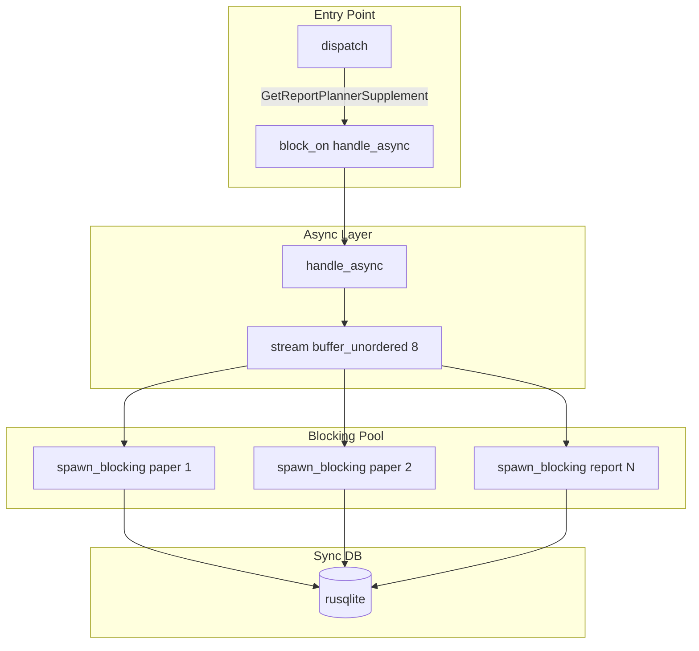

# Plan: Async Switch for get-report-planner-supplement

## Current State

- **Concurrency**: `std::thread::spawn` per paper/report request (unbounded threads)
- **DB**: Sync rusqlite via [memory_cli/src/db/store.rs](memory_cli/src/db/store.rs) `get_paper_chunks_supplement` and `get_report_fields_supplement`
- **Entry**: Sync `handle()` in [memory_cli/src/commands/get_report_planner_supplement.rs](memory_cli/src/commands/get_report_planner_supplement.rs)
- **Scope**: Only this command uses parallelism; all other memo commands remain sync

---

## Library Comparison

### Async runtimes


| Crate         | Downloads  | Ecosystem                                  | Notes                                                                           |
| ------------- | ---------- | ------------------------------------------ | ------------------------------------------------------------------------------- |
| **tokio**     | ~58M total | Hyper, tonic, tower, reqwest, sqlx default | Multi-thread work-stealing scheduler; industry standard; larger binary (~500KB) |
| **async-std** | ~12M total | Smaller                                    | Std-like APIs; simpler; smaller (~300KB); many libs (e.g. sqlx) prefer tokio    |


**Choice: tokio** — Most async crates (including sqlx) target tokio. Best long-term support and ecosystem fit.

---

### Async SQLite options


| Approach                      | Crate            | How it works                                                                         | Pros                                                                   | Cons                                                                         |
| ----------------------------- | ---------------- | ------------------------------------------------------------------------------------ | ---------------------------------------------------------------------- | ---------------------------------------------------------------------------- |
| **spawn_blocking + rusqlite** | tokio + rusqlite | Run sync rusqlite in tokio blocking pool                                             | No store changes; minimal deps; reuse existing code                    | Still uses threads under the hood; one conn per task                         |
| **tokio-rusqlite**            | tokio-rusqlite   | Wraps rusqlite; one background thread per connection; MPSC + oneshot for async calls | Native async API; keeps rusqlite semantics; ~800K downloads            | One thread per connection; store must use conn.call(...) API; adapter needed |
| **sqlx**                      | sqlx             | Async-first; SqlitePool with connection pool                                         | Native async; built-in pool; compile-time query checks; ~75M downloads | Rewrite store; new driver; heavier (185KB crate); SQLite uses libsqlite3 C   |
| **libsql**                    | libsql           | Turso fork; HTTP/Hrana; replication                                                  | Cloud/replication; native async                                        | Different DB; overkill for local SQLite                                      |


**Choice: spawn_blocking + rusqlite** — Zero store changes, minimal new deps, bounded concurrency via `buffer_unordered`. tokio-rusqlite is a good alternative if we want a true async API without rewriting store (would need a thin adapter). sqlx is best if we plan broader async migration.

---

## Approach: tokio + spawn_blocking

Use **tokio** with `spawn_blocking` to run existing sync rusqlite code on a blocking thread pool. This avoids:

- Rewriting store logic with sqlx
- Changing other memo commands
- Adding a second DB driver




---

## Implementation Steps

### 1. Add dependencies

In [memory_cli/Cargo.toml](memory_cli/Cargo.toml):

```toml
tokio = { version = "1", features = ["rt-multi-thread", "sync"] }
futures = "0.3"
```

- `rt-multi-thread`: runtime with blocking thread pool for `spawn_blocking`
- `sync`: for `Mutex` if needed
- `futures`: for `stream::iter().buffer_unordered(N)`

### 2. Add async handle and bounded concurrency

In [memory_cli/src/commands/get_report_planner_supplement.rs](memory_cli/src/commands/get_report_planner_supplement.rs):

- Add `pub async fn handle_async(...) -> Result<()>` that:
  - Keeps validation and selector conversion (sync, unchanged)
  - Uses `futures::stream::iter(paper_requests).map(...).buffer_unordered(8)` for paper lookups
  - Uses `futures::stream::iter(report_requests).map(...).buffer_unordered(8)` for report lookups
  - Each stream item: `tokio::task::spawn_blocking(move || { db::open(...); store.get_*_supplement(...) })`
  - Collect results with `.collect::<Vec<_>>().await`
- Keep existing `handle()` as a thin wrapper that creates a runtime and `block_on(handle_async(...))` for backward compatibility, OR remove it and have dispatch call the async path directly

### 3. Wire async into dispatch

In [memory_cli/src/commands.rs](memory_cli/src/commands.rs):

For `Command::GetReportPlannerSupplement`:

```rust
Command::GetReportPlannerSupplement { input } => {
    let rt = tokio::runtime::Runtime::new()?;
    rt.block_on(get_report_planner_supplement::handle_async(
        args.dry_run, &args.db, args.schema.as_deref(), &input
    ))
}
```

No other commands change.

### 4. Bounded concurrency (buffer_unordered)

Default max concurrent lookups: **8** (configurable later via env or arg if desired).

```rust
use futures::stream::{self, StreamExt};

let paper_results: Vec<_> = stream::iter(paper_requests.iter().cloned())
    .map(|(paper_id, db_filters)| {
        let db_path = db_path.clone();
        let schema_path = schema_path.clone();
        tokio::task::spawn_blocking(move || {
            let conn = db::open(db_path.as_str())?;
            if let Some(ref sp) = schema_path { db::migrate::apply_schema(&conn, sp)?; }
            let store = db::store::Store::new(&conn);
            store.get_paper_chunks_supplement(&paper_id, &db_filters)
        })
    })
    .buffer_unordered(8)
    .collect::<Vec<_>>()
    .await;
```

Same pattern for report lookups.

### 5. Error handling

- `spawn_blocking` returns `Result<Result<PaperSupplement, anyhow::Error>, JoinError>`
- Flatten: `match spawn_result { Ok(Ok(ps)) => Ok(ps), Ok(Err(e)) => Err(e), Err(je) => Err(je.into()) }`
- Preserve existing per-request warning logs for failures

---

## Files to Modify


| File                                                                                                                 | Change                                                                          |
| -------------------------------------------------------------------------------------------------------------------- | ------------------------------------------------------------------------------- |
| [memory_cli/Cargo.toml](memory_cli/Cargo.toml)                                                                       | Add tokio, futures                                                              |
| [memory_cli/src/commands/get_report_planner_supplement.rs](memory_cli/src/commands/get_report_planner_supplement.rs) | Add `handle_async`, refactor `handle` to use `block_on(handle_async)` or remove |
| [memory_cli/src/commands.rs](memory_cli/src/commands.rs)                                                             | For GetReportPlannerSupplement: create runtime, `block_on(handle_async(...))`   |


---

## Alternatives Considered

### sqlx

Using **sqlx** with `SqlitePool` would give native async DB access but would require:

- Rewriting `get_paper_chunks_supplement` and `get_report_fields_supplement` with sqlx API
- A separate async store path or full migration of store to async
- More code churn

### tokio-rusqlite

`tokio-rusqlite` wraps rusqlite with `Connection::call(|conn| { ... })` — each call is sent to a background thread and returns a Future. Store methods would need to become `async` and use `conn.call(...).await` instead of direct `conn.prepare(...)`. More invasive than spawn_blocking but gives a true async API and keeps rusqlite semantics. Would require a small async store adapter used only by the supplement command.

---

The spawn_blocking approach keeps the existing store and DB layer unchanged while still providing async-style concurrency and bounded parallelism.

---

## Out of Scope

- Converting other memo commands to async
- Adding sqlx or replacing rusqlite
- Configurable max concurrency (can add later via `MEMO_SUPPLEMENT_MAX_CONCURRENCY` env)

