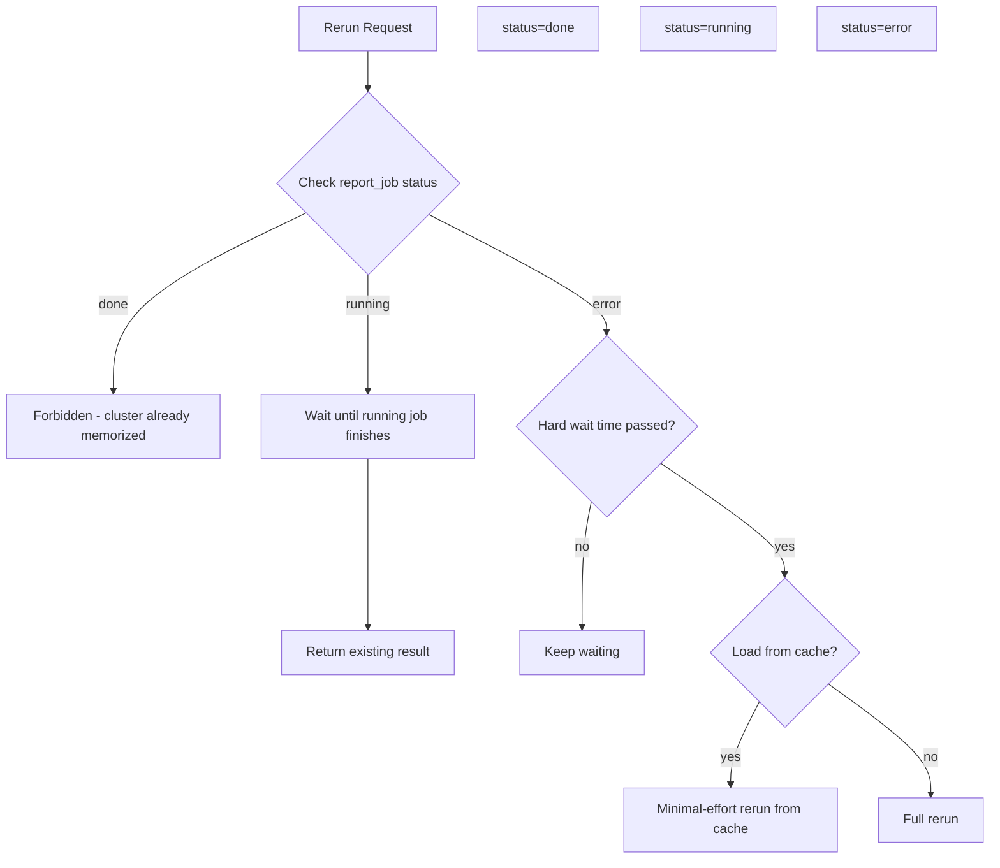

# Report Generation Storage and Rerun Policy

**Scope:** This document states the storage and rerun policies for report generation jobs. Storage is two-part: cache to local filesystem for expensive workflows (via workflow register) and write to DB ("memory") as the last step. Rerun behavior depends on job status (done/running/error) and is enforced by the Evolution system invariant: one cluster can only be memorized once.

---

## 1) Storage Policy

Storage has two parts:

### 1.1 Local FS cache (workflow register)

- **Purpose:** Persist expensive workflow outputs for failure recovery.
- **Implementation:** A workflow register records step/loop status and outputs for each node. On failure, the trace is written to a cache path (JSON). Rerun can load from this cache for minimal-effort resume.
- **When used:** For failure tasks—when a job errors, the partial trace is cached so a later rerun can skip completed steps and resume from the last successful point.

**References:**
- [workflow_register/register.py](../src/reader/pipelines/report_generation/workflow_register/register.py) — `write_trace_to_cache()` writes `WorkflowTraceReport` to local path
- [workflow_register/models.py](../src/reader/pipelines/report_generation/workflow_register/models.py) — `WorkflowTraceReport`, `WorkflowTraceNode` data models

### 1.2 DB (memory) — persistent storage

- **Purpose:** Persistent storage. Once written, the report and its links become part of "memory."
- **Implementation:** Write to DB as the **last step** of the task (the "done" task). Implemented via `memo new-memory` command, which persists report, topic links, cluster links, etc.
- **When used:** Only when the full pipeline completes successfully. The memory write is the final step before marking the job as `done`.

**References:**
- [blocks.py](../src/reader/pipelines/report_generation/blocks.py) — `_save_report_to_memory` step calls `memo.new_memory()` as the final step

---

## 2) Rerun Policy

**Evolution system invariant:** Memory is an Evolution system. One cluster can only be memorized/observed once. Once memorized, it becomes part of memory and cannot be deleted or forgotten.

| Job Status | Rerun Behavior |
|------------|----------------|
| **done** | **Forbidden.** Cannot rerun. The cluster is already memorized. |
| **running** | Rerun request is put on a **waiting loop** until the already-running job finishes; then return its result. |
| **error** | **Hard waiting time** (set by memory config). Once passed, job can be resumed. Load from cache if possible for **minimal-effort rerun**. |

### Rerun decision flow



---

## 3) Job Status Tracking (Safety)

To make this policy safe and enforceable, a **DB table** tracks job status:

- **DB:** a sqlite db owned by report generation workflow.[code](../src/reader/pipelines/report_generation/db)
- **Table:** `report_job`
- **PK:** `cluster_pk_hash` (1 job per cluster; also serves as lock)
- **Status:** `running` | `done` | `error`
- **Links to:** `report_id` when done (NULL otherwise)

```sql
CREATE TABLE IF NOT EXISTS report_job (
  cluster_pk_hash TEXT PRIMARY KEY,          -- 1 job per cluster (also your lock)
  status          TEXT NOT NULL,             -- 'running'|'done'|'error'
  created_at      TEXT NOT NULL,
  updated_at      TEXT NOT NULL,
  report_id       INTEGER,                   -- set when done; NULL otherwise
  FOREIGN KEY (cluster_pk_hash) REFERENCES cluster(pk_hash) ON DELETE CASCADE,
  FOREIGN KEY (report_id) REFERENCES report(report_id) ON DELETE SET NULL
);
```
